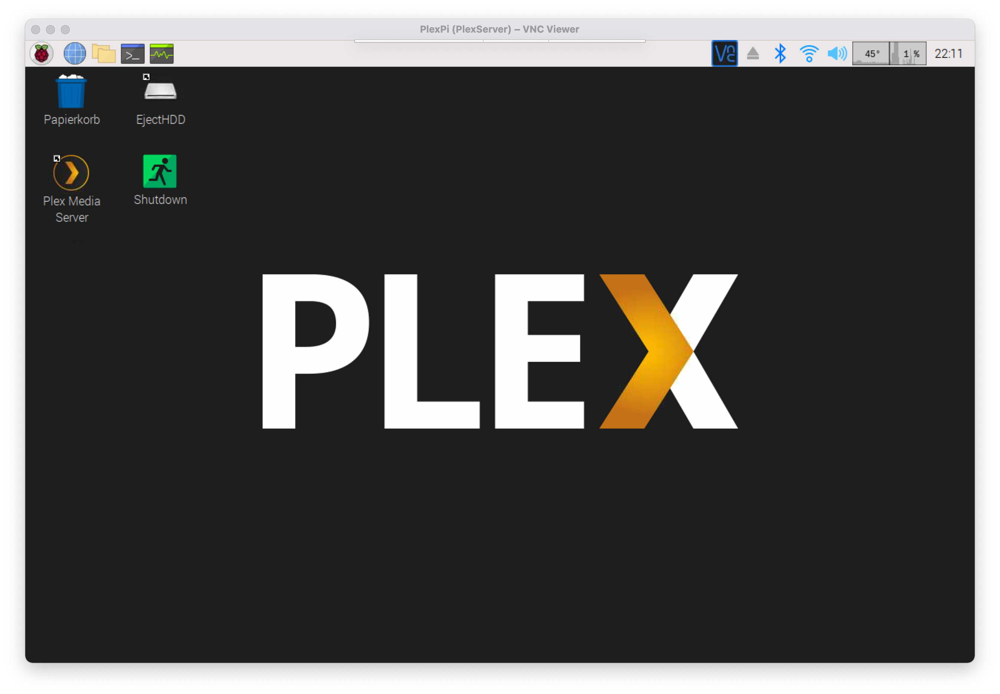

# PLEX Media Server on Raspberry Pi

Running Plex Media Server on Raspberry Pi 4



### 1. Install Plex Media Server

Once you have Raspbian installed ensure the Raspberry Pi is fully up to date

```sh
sudo apt-get update
sudo apt-get upgrade
```

Install the `apt-transport-https` package, which allows Plex Server from an HTTPS source

```sh
sudo apt-get install apt-transport-https
```

Add PGP key for the `plex.tv` repository

```sh
curl https://downloads.plex.tv/plex-keys/PlexSign.key | sudo apt-key add -
```

Add the `plex.tv` repository to the package source list

```sh
echo deb https://downloads.plex.tv/repo/deb public main | sudo tee /etc/apt/sources.list.d/plexmediaserver.list
```

Update the package list now containing the `plex.tv` repository

```sh
sudo apt-get update
```

Install Plex Media Server

```sh
sudo apt install plexmediaserver
```

To avoid any permissions issue, make Plex run under the Pi user

```sh
sudo nano /etc/default/plexmediaserver.prev
```

Change `plex` to `pi` in the following line and save the file

```sh
PLEX_MEDIA_SERVER_USER=plex
```

Restart the Plex Media Server

```sh
sudo service plexmediaserver restart
```

### 2. Mount HDD correctly

If using a NTFS HDD drive, install the `ntfs-3g` driver

```sh
sudo apt-get install ntfs-3g
```

Connect the drive and set following permissions (recursively)

```sh
sudo chmod -R 755 /media/pi
```

Now Plex should be able to find connected drive as source

### 3. Spin-Down HDD on shutdown

In order to spin down the HDD manually or on shutdown, another script is necessary

- Copy contents of `desktop` folder to `/home/pi/Desktop`
- Copy contents of `scripts` folder to `/home/pi/Scripts`
- Replace {NameOfHDD} with HDD name in `scripts/ejectHDD.sh`

Now a manual eject of HDD or shutdown including spindown of HDD is possible using the desktop shortcuts. Therefore a capable cable is required as [Startech eSATA/USB3](https://www.startech.com/de-de/hdd/usb3s2esata3) (only `RevA` is working, spindown with `RevB` doesn't work anymore)

### Troubleshooting

When the Raspberry Pi Server is unable to `claim` from dashboard, rename `Preferences.xml` to e.g. `Preferences-bak.xml` and restart the Plex-Server

```sh
cd /var/lib/plexmediaserver/Library/Application Support/Plex Media Server/ && mv Preferences.xml Preferences-bak.xml

sudo service plexmediaserver restart
```

Open `localhost:32400` and repeat the server configuration. Afterwards claiming of the Raspberry Pi should work again.

### Update

In order to update the Plex Media Server on the Raspberry Pi run

```sh
sudo apt-get update
sudo apt-get upgrade
```

### Sources

- [How to Turn a Raspbery Pi into a Plex Server](https://www.howtogeek.com/400958/how-to-turn-a-raspbery-pi-into-a-plex-server/)
- [How to set up a Raspberry Pi Plex server](https://thepi.io/how-to-set-up-a-raspberry-pi-plex-server/)
- [Setting up your PLEX Server on Raspberry Pi 4](https://medium.com/codex/setting-up-your-plex-server-on-raspberry-pi-4-28855b906679)
- [Plex TV Forum - Unable to “Claim” server](https://forums.plex.tv/t/unable-to-claim-server/646676/3)
- [Plex-Update auf dem RaspberryPi](https://blog.devilatwork.de/plex-update-auf-dem-raspberrypi/)
- [Plex Media Server can’t find files on USB drive](https://forums.plex.tv/t/plex-media-server-cant-find-files-on-usb-drive-connected-to-raspberry-pi-3/175813/14)
